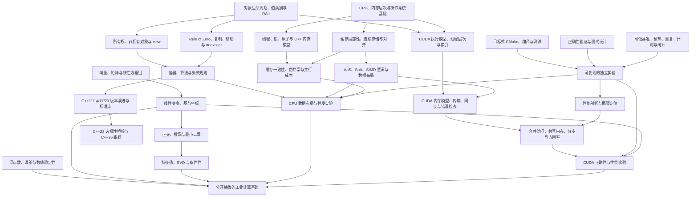

# CUDA / C++ 高性能系统开发知识图谱

```yaml
last_updated: 2026-08-12
stage: rolling_learning_iteration
status: confirmed
current_day: 2
baseline: capability-baseline.md
```

## 用途

本图谱定义长期主线中的知识依赖、优先级、掌握目标和证据门槛。它用于决定后续资源选择与学习顺序，不是 30 天日程；Day 1 已通过独立解释证据将生命周期主题提高到“2. 能够解释”，当前准备开始 Day 2。

所有内容只采用公开、合成或自行编写的材料。工作场景只保留“工业软件中的通用数学与性能问题”这一抽象背景，不记录或反推任何公司、客户或未公开实现。

## 统一口径

掌握层级只使用以下四级：

1. 看过；
2. 能够解释；
3. 能够独立实现；
4. 能够分析正确性与性能。

优先级只使用以下四类：

- **现在深入**：当前主线的直接前置知识，应尽快形成可验证能力。
- **半年内学习**：依赖当前基础，预计在主线推进中逐步进入。
- **只需了解**：建立术语、边界与工具判断，不以独立实现为近期目标。
- **暂时不学**：与当前主线弱相关、尚无正式任务依据或存在明确范围限制。

## 依赖总图

箭头表示“前者是后者的重要前置”，不表示必须把一个主题全部学完才能接触下一个主题。



## 现在深入

| 领域 | 主题边界 | 主要前置 | 近期目标 | 达标证据 |
|---|---|---|---|---|
| 线性代数基础 | 向量、矩阵、线性组合、线性方程组、线性变换、基与坐标 | 基础代数 | 3. 能够独立实现 | 手算解释与小规模 C++ 实现相互验证 |
| 正交与投影 | 点积、范数、正交、投影、最小二乘的几何意义 | 线性代数基础 | 3. 能够独立实现 | 推导、边界情况和数值例子 |
| C++ 生命周期 | 对象生命周期、临时对象、引用/指针、RAII、值类别 | 现有 C++ 经验 | 4. 能够分析正确性与性能 | 能指出悬空、所有权和不必要复制，并给出修正与代价分析 |
| 所有权与 view | `unique_ptr`、`shared_ptr`、`weak_ptr`、非拥有引用、`std::span`/`std::string_view` | C++ 生命周期 | 4. 能够分析正确性与性能 | 独立实现安全接口，说明生命周期前提与所有权成本 |
| 复制与移动 | Rule of Zero、特殊成员函数、移动语义、`noexcept` 与容器行为 | C++ 生命周期 | 4. 能够分析正确性与性能 | 合成类型实验、调用观察和异常安全分析 |
| 容器与失效 | 连续/节点式容器、复杂度、容量变化、迭代器/指针/引用失效 | 生命周期、复制与移动 | 4. 能够分析正确性与性能 | 场景判断、独立测试及数据布局解释 |
| 现代 C++ 版本基础 | C++11 生命周期/移动/并发基础，C++14 泛型与编译期增量，C++17 view/词汇类型/泛型增强，C++20 Concepts/Ranges/`span`/并发与工程增量 | C++ 生命周期、所有权、复制移动、容器 | 3. 能够独立实现；关键正确性主题目标为 4. 能够分析正确性与性能 | 按标准模式构建的独立练习、版本归属解释、兼容边界与工具链支持记录 |
| 内存与数据布局 | 内存层次、缓存行、连续访问、顺序/随机访问、对齐、AoS/SoA | 计算机组成基础 | 4. 能够分析正确性与性能 | 先验预测、正确性测试、重复基准与结果解释一致 |
| 正确性与基准 | 测试基准、预热、重复、统计、计时范围、编译配置、防止计算被消除 | C++ 与构建基础 | 4. 能够分析正确性与性能 | 可复现实验记录，不根据单次测量下结论 |
| CMake 基础 | target、源文件、include、依赖、编译特性、构建类型、测试入口 | 基本编译流程 | 3. 能够独立实现 | 从空目录构建多文件 C++ 小项目并运行测试 |
| 并发硬件基础 | 数据竞争、互斥、原子、内存顺序入门、缓存一致性、伪共享 | 生命周期、内存层次 | 3. 能够独立实现 | 正确性推理、线程局部累积实验和受控共享写入比较 |
| CUDA 基础 | 执行模型、grid/block/thread、索引、kernel、内存空间、同步和错误检查 | C++、内存层次 | 3. 能够独立实现 | 使用合成数据的正确 kernel、CPU 对照和完整错误检查 |

## 半年内学习

| 领域 | 主题边界 | 依赖 | 目标层级 |
|---|---|---|---|
| 进阶线性代数 | 特征值/特征向量、SVD、秩、条件数 | 线性变换、正交与投影 | 3. 能够独立实现 |
| 数值基础 | IEEE 754、误差传播、稳定性、尺度与容差 | 线性代数、基础算法 | 4. 能够分析正确性与性能 |
| 计算机系统 | 虚拟内存、分页、系统调用、调度、NUMA 基本影响 | 内存层次与操作系统基础 | 2. 能够解释；直接相关部分目标为 3. 能够独立实现 |
| 进阶并发 | C++ 内存模型、memory order、无锁结构的适用边界、任务并行 | 并发硬件基础 | 3. 能够独立实现 |
| 性能工具 | 采样、调用栈、硬件计数器、Roofline 基本判断 | 可信基准、计算机系统 | 4. 能够分析正确性与性能 |
| CPU 优化 | 向量化意识、分支、预取、批处理、分配策略 | 数据布局、性能工具 | 4. 能够分析正确性与性能 |
| CUDA 优化 | 合并访问、共享内存、bank conflict、分支发散、占用率、异步与 stream | CUDA 基础、性能工具 | 4. 能够分析正确性与性能 |
| 并行算法 | reduction、scan、histogram、分块与负载均衡 | 并发或 CUDA 基础 | 4. 能够分析正确性与性能 |
| 通用几何与坐标 | 坐标系、仿射变换、齐次坐标、基础几何谓词 | 线性代数、数值基础 | 3. 能够独立实现 |
| 工程化 | 测试组织、基准自动化、可移植构建、依赖管理基本策略 | CMake 基础 | 3. 能够独立实现 |
| 新标准跟进 | C++23 选择性桥接；C++26 中与线性代数、SIMD、数据布局、并发和工程直接相关且实现可用的设施 | C++11–20 版本基础、对应领域前置 | C++23 目标为 2–3；C++26 当前目标为 1–2，支持稳定后再提高 |

## 只需了解

| 主题 | 当前边界 |
|---|---|
| CPU 微架构细节 | 了解流水线、乱序执行、分支预测和硬件计数器术语；按实验需要深入 |
| GPU 架构代际差异 | 先理解通用执行与内存模型，不背诵特定型号参数 |
| 分配器、PMR 与 NUMA 策略 | 了解何时可能成为瓶颈，出现证据后再深入 |
| 模板元编程与高级泛型 | 基础模板、C++14 泛型 Lambda、C++17 `if constexpr`/折叠和 C++20 Concepts 属于版本主线；复杂 TMP 技巧只需阅读常用形式，不作为当前目标 |
| 操作系统 I/O 与网络 | 保持系统级概念，不展开为独立主线 |
| 微积分、概率统计 | 建立按需补充入口，不先展开完整课程 |

## 暂时不学

- 编译器实现与编译器理论；只保留理解编译选项、优化报告和生成代码所需的使用层知识。
- 图形学与渲染管线；与当前数学或 GPU 基础重合的通用部分仍由对应节点覆盖。
- 交易系统设计与低延迟交易工程。
- 尚未正式分配的具体重构任务及其专用方案。
- 点云相关内容不属于本项目范围，不建立学习节点、实验或资料清单。

## 跨主线关系

- 线性代数提供表达、推导和正确性基准；C++ 提供可控的对象与资源模型。
- 计算机组成解释数据布局和并发成本；基准与剖析用于验证，而不是替代推理。
- CMake、测试和错误检查为 CPU/CUDA 实验提供可复现载体。
- CUDA 不等待数学或 C++ “全部学完”；在满足对应最小前置后，用小型合成实验交叉推进。
- 通用工业计算只作为知识汇合点，不写入任何实际工作算法、数据、结构或性能数字。

## 证据门槛

| 层级 | 最低证据 |
|---|---|
| 1. 看过 | 有阅读或学习记录，能指出主题范围与术语 |
| 2. 能够解释 | 用自己的语言解释机制、前提和至少一个反例或边界 |
| 3. 能够独立实现 | 不照抄现成答案，使用独立代码/推导完成任务，并通过正确性验证 |
| 4. 能够分析正确性与性能 | 说明不变量、复杂度、生命周期或数值边界；设计可信测量并解释结果与限制 |

工作经历的抽象自述可以记录为能力线索，但不能替代公开、可复现的验证证据。任何层级提升都应链接到后续笔记、练习、测试或基准记录。

## Stage 1 剩余门禁

- [x] 建立知识领域与依赖关系。
- [x] 标注四类优先级。
- [x] 为主要节点定义目标层级与证据门槛。
- [x] 将现有能力线索映射到独立基线文件。
- [x] 按能力基线的统一完成口径处理 B1–B7，并记录实际证据或有依据的起点诊断。
- [x] 用户确认知识图谱与能力基线足以进入资源选择。

Stage 1 已完成。当前资源组合保存在 [../RESOURCES.md](../RESOURCES.md)；用户确认 Stage 2 前不制定 30 天计划、不开始 Day 1。
